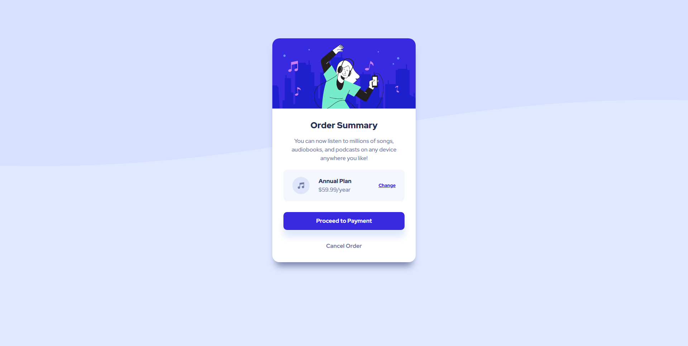
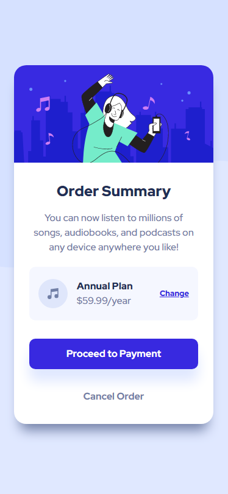

# Frontend Mentor - Order summary card solution

This is a solution to the [Order summary card challenge on Frontend Mentor](https://www.frontendmentor.io/challenges/order-summary-component-QlPmajDUj). Frontend Mentor challenges help you improve your coding skills by building realistic projects. 

## Table of contents

- [Overview](#overview)
  - [The challenge](#the-challenge)
  - [Screenshots](#screenshots)
  - [Links](#links)
- [My process](#my-process)
  - [Built with](#built-with)
  - [What I learned](#what-i-learned)
  - [Continued development](#continued-development)
  - [Useful resources](#useful-resources)
- [Author](#author)

## Overview

### The challenge

Users should be able to:

- See hover states for interactive elements

### Screenshots

#### Desktop Version


#### Mobile Version


### Links

- Solution URL: [https://github.com/ryankpa/order-summary-component-main](https://github.com/ryankpa/order-summary-component-main)
- Live Site URL: [https://ryankpa-order-summary-component.glitch.me/](https://ryankpa-order-summary-component.glitch.me/)

## My process

### Built with

- Semantic HTML5 markup
- CSS custom properties
- Sass CSS Preprocessor
- Flexbox
- CSS Grid
- Mobile-first workflow
- [React](https://reactjs.org/) - JS library

### What I learned

First and foremost, I learned how having a design ready for translation into a component is immensely helpful. Most of my practice with front end work involved me winging most of my layouts, which made the process feel directionless and cluttered. Having something to reference helped me come up with a gameplan to bring the concept to life.

I also learned a little bit about making my html code more accessible through assigning roles to elements. More specifically, I learned that links that are used as buttons can be given a "button" role as shown here:

```html
<a class="order_grid_item" href="#" role="button">
  Change
</a>
```

Regarding styling, this was a great project for me to start working with Sass. I made use of two of its features, and I found them pretty neat. The first I made use of was the ability to store styles in variables:

```scss
$breakpoint-mobile: 425px;
// ...
$primary-brightblue: hsl(245, 75%, 52%);
$neutral-verypaleblue: hsl(225, 100%, 98%);
```

Being able to refer to values by name helps my code easier to read and adjust, and it'll help with readability for when I come back to it after a while.

I also used the Mixin declarations, which I found very helpful to prevent code duplication and allow for some flexibility using variables:

```scss
@mixin flex($direction) {
    display: flex;
    flex-direction: $direction;
}
```

I solely used it for defining flexboxes and specifying its direction in one line. I realize I could have made use of the flex-flow property instead, but I wanted to give Mixins a try.

### Continued development

I would like to continue focusing on making my HTML more semantic and accessible for assistive technologies like screenreaders. I also definitely want to explore using Sass to its fullest potential. I can now finally understand how useful CSS preprocessors can be for projects on larger scales. 

For plain CSS, I'd like to improve on making my stylesheets more clean and efficient. Adhering to a top-down approach when it comes to styling can definitely help me achieve this goal.

### Useful resources

- [Getting Started with Sass](https://sass-lang.com/guide) - This was a great introduction to using Sass. With my continued use of it, I will likely be referencing its official documentation.

## Author

- Website - [My Github Pages Site](https://ryankpa.github.io/)
- Frontend Mentor - [@yourusername](https://www.frontendmentor.io/profile/yourusername)
